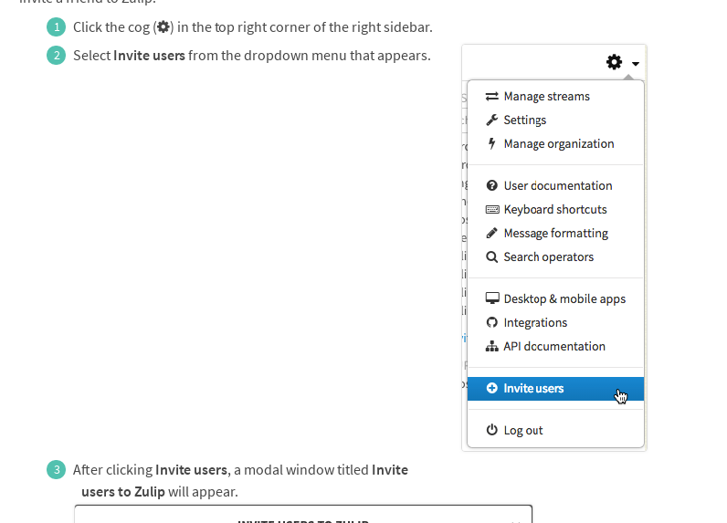

# Reviewing user guides: People.

In this document, I reviewed the following:

* Check whether someone is on-line
* Invite another user

-----

## Check whether someone is on-line

For the sake of consistency, I suggest renaming on-line to online. Afterall, it
is much more used instead of the dashed version, at least from my experience.

In the explanation, it would be more efficient to just use the icon instead, no
need to explain what is already obvious. I would suggest to move the
description of the icon, *into* the icon. Meaning that when the user hovers on
the icon, it will show the description (in case it wasn't obvious enough, which
it is).

It would be also helpful to document just how long did it take for a circle to
turn into a different color. This includes, but not limited to (if any)
: green to white, green to orange, orange to white, and green to paler green. 

One final suggestion that I want to make is about redirecting people to the
step that can't be explained so easily without retyping the entire explanation.
I suggest add a link to **Sending messages -- Group private messages** into
"messaged users in a group PM" (last paragraph, first sentence). This way, user
can find out what, and how to make a group PM. If I hadn't reviewed past
documentations, I wouldn't even know for *sure* that there exists a section for
that.

## Invite a friend to Zulip

Introduction looks good, it is short **and** straight to the point, so moving
on.

On step 1, you can also access the menu by just pressing `g` in PC. I suggest
adding a snippet of that info into step 1. An example might be something like
"Click the cog icon in the top right corner of the right sidebar or just 
press `g` on your keyboard to access the menu".

You can see that step (2) is taking a big space. I'm talking about its helping
figure. Not only it is taking a big space, it is not utilizing it to its
maximum. So for this suggestion actually leads to my another suggestion.

There is another way to invite the user without having to open the menu. It is
to click "Invite more users" below the user list. Take a look at this figure:

Not only I purposefully show both "Invite users" and "Invite more users", I
also decided it would be a good idea to just stretch the size of the figure. If
not, I would end up having unused, weird space like this:

So finally, to wrap this up, I suggest putting additional information on how 
the user can invite the other user by clicking "Invite more users" below the
user list, and to maximize the space that is taken for the screenshot so it 
doesn't create a huge empty gap.
