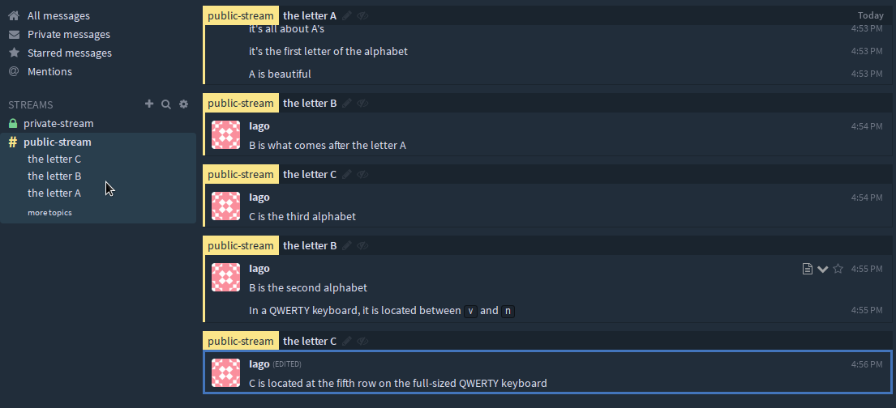
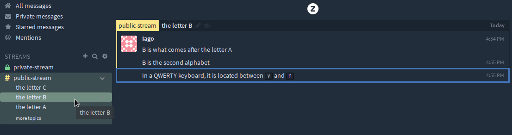
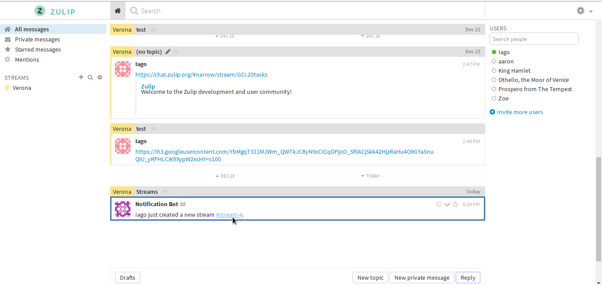

# Reviewing user guides: Streams & topics, Part 1.

In this document, I reviewed:

* About streams and topics
* Browse and subscribe to streams
* Create a stream
* View your stream subscriptions
* Add someone to a stream
* Change the stream description
* Rename a stream

## Preface

Looking briefly at the sections that I'm going to review, I don't expect much
change and problems. The sections are written comprehensively with some guides
here and there. I'm going to try my best to point out things that can be
improved, though, along with the reasons and examples. Most of it is minor, but
some may be more emphasized than others, which I will give a **bold** to mark
it. 

The documenters are not expected to follow the exact suggestion that is
being told, the documenters can take the review just as a guide to help improve
the documentation as a whole. After saying all of that, here's the review.

## Review

In the previous reviews of mine, I write the review paragraph by paragraph. One
section usually contains three or more. In this review, I'm going to take a
more structured approach writing the review.

### About streams and topics

#### Introductory section
		
The introduction needs expansion. It doesn't explain the section as a whole.
It's just saying what is already obvious. I suggest expanding from

> In Zulip, conversations are organized by conversation **streams** and
> **topics**

Into

> In Zulip, conversations are organized by conversation **streams** and
> **topics**. The two can have a similar purpose, but it is different. The
> differences between the two will be discussed in these subsections below: 

#### About streams

This section lacks the definition of stream. Since it is a documentation, it is
often appropriate to write that kind of stuff. I suggest adding the definition
of stream from [the glossary](https://chat.zulip.org/help/zulip-glossary#stream
). Here's an example:

> According to [the glossary](https://chat.zulip.org/help/zulip-glossary#stream
), a stream is a channel of topics expected to fall within a certain scope 
of content. Streams are located on the left sidebar. Streams are either public 
(used for open discussions) or private (invite-only).

> On Zulip, users communicate with each other in group chats by sending 
> messages to streams, which are similar to conversation threads.

Adding a figure is also useful to indicate which one is a stream, and which one
is a topic. Here's an example:

For completeness, it is often good to show what is the visual differences
between a public stream and a private stream if possible. Here's an example:

Or just combine both of them into one. This can be accomplished by pasting the
list element into `public-stream`, highlighted by a blue color:

Which results in this:

The rest of the explanation seems good and doesn't need any addition.

#### About topics

Document how the clicking the topic can narrow the chat into that specific
topic. Here are the examples:

Above suggestions about the visual display of topic may also apply here.

### Browse and subscribe to streams

#### Introductory section

I suggest adding more clarity to the first statement, from

> On Zulip, users primarily communicate with each other by sending messages 
to streams...

To

> On Zulip, users primarily communicate with each other by sending messages
based on their topic in appropriate streams...

I also suggest adding a boxed note about how to find the organization's default
streams. Here's an example for the contents of the note box, some of it is
based on **Set default streams for new users**:

> You can check your organization's default streams by going to the "Default
> streams" tab of the Manage organization page. Or go to https://your-organi
zation-link/#organization/default-streams-list, replacing
`your-organization-link` with your organization's link.

#### Browse streams

Explained correctly. Moving on.

#### Subscribing to streams

I suggest adding more information on how the user can get subscribed into a
private stream. Here's an example:

> Private streams can only be subscribed if your organization's admin invited
> you to that private stream, or if you have already entered it.

##### Subscribing when a stream is created

The first and second paragraph can be joined into one single paragraph. They
discuss about the same topic and don't need to be separated individually.

Because I haven't seen a section explaining about how to enable new stream
notifications, here's what I'm talking about:

Documenters can add a blue boxed note on how admins can do that below the
paragraph, just before the next picture.

**There is no "Subscribe to 'stream-name' button**. Take a look at the
announcement channel (currently set to Verona) after the admin has created a
public stream:

The message did **not** present the user the option of subscribing to the
stream, instead it just takes the user to the stream **without** subscribing it
automatically. However, there is a **Subscribe** button below that:

I strongly suggest clarifying this because it is misleading.

##### Subscribing later

Nothing to say here. Moving on.

### Create a stream

#### Introductory section

I was honestly surprised that even the admins cannot see message of 
a private stream that is created by a normal user (if possible) if the admin 
is not invited to the private stream. The documenter should add a note on 
that.

#### Create a new stream

Adding a helping figure is not a very tough thing to do, so it's best too add
one, especially when the steps are long, just to create a sense of
"checkpoint" to make sure that the reader is doing the step correctly.

Here are the examples:

### View your stream subscriptions

This section redirects to **Browse and subscribe to streams**. See above for
the review.

### Add or invite someone to a stream

#### Introductory section

Introduction looks good, so moving on.

#### Steps

Step 4 may be confusing to some users, besides that, It is a good idea to show
how it should look if the reader followed the previous steps correctly. Here's
an example:

This can be placed below step 4 or step 5.

Other than that, the explanation seems pretty well written. Should be
relatively easy to follow.

### Change the stream description

#### Introductory section

Nothing surprising here, it is straight to the point, even without this
introduction text, it doesn't decrease or increase the quality of the
documentation.

#### Steps

**There is no Administrator settings section**. Maybe I was wrong, and if I
was, would be a great idea to attach a helping figure (screenshot) to show
where it is.

**There is no Change stream description button**. I just met with these:

### Rename a stream

#### Introductory section

Again, nothing too interesting here (see above section for reason), so moving on.

#### Steps

**There is no Administrator settings section**. See above for explanation.

**There is no Rename stream** field. Instead what I can find is this:

]

Overall, the step is written such that it is easy to follow. No problem on
that.

## Conclusion

Sometimes when a section contains a wall of text, there's more chance on not
properly following the steps than a section with some helping figures
(screenshots). I suggest adding more of them just to serve as a checkpoint to
the users to confirm that they are doing the steps correctly. Besides, it's
just generally good for the user to see instead of just bunch of texts.

When a change is made on the interface, it is best to tell the documenter about
what changes is being made, so the documentation is up-to-date and reflects the
current version of the client.
