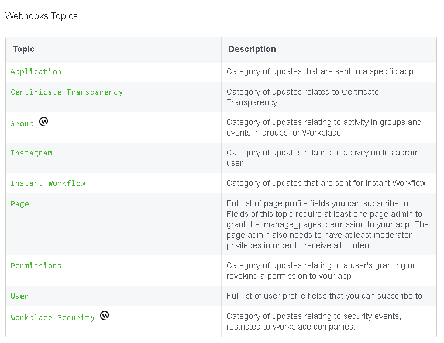
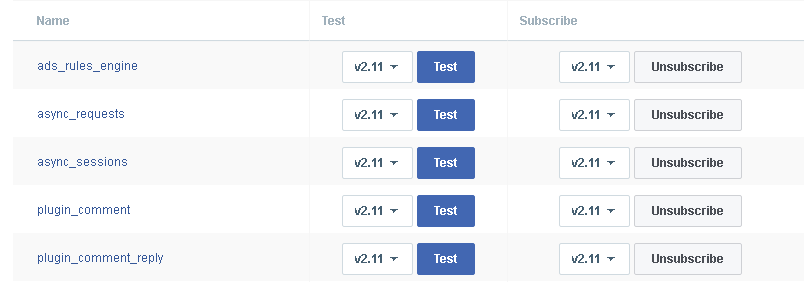

# Facebook Integration Investigation

[Facebook](https://www.developers.facebook.com) is a social networking service that also allows developers
to track analytics of their apps. (The Analytics can only be accessed by the developer of the app, users of
the app cannot access them.)

Facebook has a very detailed notification model for sending notifications to users.

Facebook has no integrations with Slack, but a webhook URL can be configured to receive payloads.

* The Notification Model of Facebook is-
   
  

For each of the above parameters, there are at least 15 cases (some have about 40) for which 
Facebook can send notifications to the Webhook URL with a verification token.

* Some Cases of The 'Application' parameter are-
    
  
 
When one's App/Website is configured to use the Facebook SDK, (Configuration Help can be found [here](https://developers.facebook.com/products/analytics/quickstarts))
Facebook then logs the events that happen in the app/website & sends out notifications for
the parameters that have been configured to use the webhook. Also, different cases are invoked in the 
parameter only if one subscribes to those cases.
e.g.
If I configure my App to use the Facebook SDK, & configure the parameter 'User' for sending out 
notifications & I subscribe to the 'email' case in 'User', then Facebook sends out a notification
to the webhook every time a new user email is added/deleted from the App.

## Links
Facebook For Developers: https://developers.facebook.com

## Other Notes
The 4 parameters ('Users', 'Pages', 'Application' & 'Permissions') were chosen considering their use
if integrated with Zulip, & the cases for each parameter were also chosen considering use in Zulip.

## JSON Naming Convention Explanation:

The Naming of the JSON fixtures is - "Parameter Name"_ 'Case name'

## Explanation of JSON Fixtures
* User
1. Feed - The fixture generated when a user adds/removes something from his feed in the app.
2. Email - The fixture generated when a user adds/changes his E-mail in the app.

* Permissions
1. Ads Management - The fixture generated when change occurs in the ads on the app (i.e. addition or removal)
2. Manage Pages - The fixture generated when change occurs in page/pages of the user in the app.

* Page
1. Conversation - The fixture generated when a conversation is added/removed from a page in the app.
2. Website - The fixture generated when a website (link or a nested webpage) is added/removed from a page
in the app.

* Application
1. Plugin Comment - The fixture generated on generation of a comment by a plugin in the app.
2. Plugin Comment Reply - The fixture generated when the comment is replied upon in the app.
