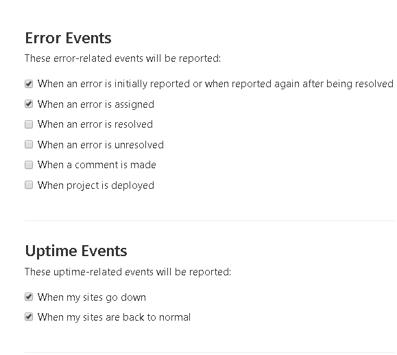
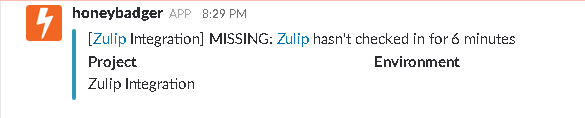

# Honeybadger Integration Investigation

[Honeybadger](https://honeybadger.io) is a service that reports errors & outages generated in one's application in production.

When an issue occurs, Honeybadger notifies the User/Team via Email/SMS/Chat.

Honeybadger already has integrations with Slack & sends a notification to Slack for the following cases: 

* When an error is generated

* When a comment is made

* When a project is deployed

* When Site/App goes down (Uptime Event)

* When Site/App is back to normal

Integration Addition:
 

The Notification Model is:
 

The Error Notification is:
 

The Uptime Notification is:
 

The Check-in Notification is:
 

## Links

Slack - https://api.slack.com

## Other Notes

* Honeybadger provides only 1 Uptime Check for the Trial period.
  For more Uptime Checks, the service has to be bought.
  
  Fixtures Generated | Fixtures Not Generated
  ------------------ | ----------------------
  Adding Integration | Error Generation in App on Honeybadger
  Creating a Check-in | Resolving Error
  Creation of Test Error | Commenting on the Error
* Some Fixtures (Mentioned Above) were not generated because of some error 
  in the webpage.
  1. The Error in the Application was not detected by Honeybadger, hence 
     no error was generated in the project.
  2. Error resolving was not possible, as it needs an error, which was not 
     generated due to some error on the webpage of Honeybadger.  
  3. No comment was added as commenting requires error generation, which was
     not generated on the Honeybadger page but was generated in the console.        
* No Fixture was found in the API Documentation for Message Cases.
