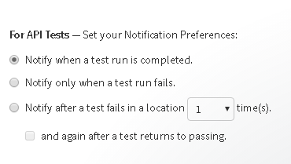
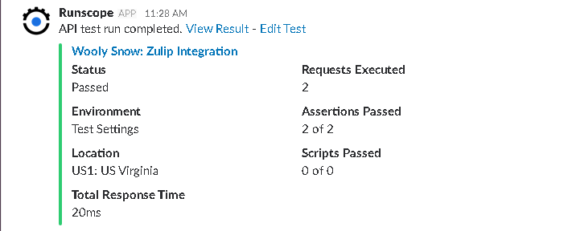
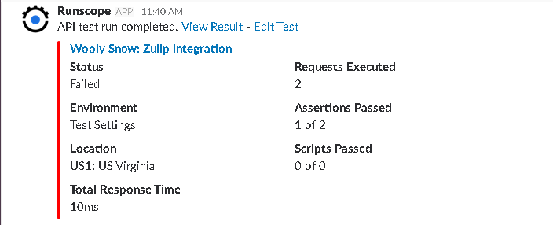

# Runscope Integration Investigation

* [Runscope](https://runscope.com) is a company that provides solutions for API Performance Testing.

* Runscope helps a company to conduct API Performance tests on an independent, hassle-free platform.

* Runscope already has integrations with Slack & generates notifications in Slack for the following cases:

  1. Test Passed

  2. Test Failed

* The Notification Model is:
   
  

* The 'Test Passed' notification is:
   
  

* The 'Test Failed' notification is:
   
  

## Links

Slack API - https://api.slack.com

## Other Notes
* Paid Subscription to Runscope enables users to create a larger team. 
  It also increases test limits & amount of requests stored per bucket.
* The Notification Model attached above shows notifications generated for Email.
  Slack receives only 'Test Passed' & 'Test Failed' notifications.
