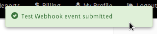

# Researching How Insping Integration Should Work

## Preface

This document will explain:

* How to add an incoming webhook to (Insping)[insping.com]
* What kind of payload to expect from Insping
* Kinds of messages that one may get from Insping

Attempts have been made to make this document as clear and concise as possible.
Any suggestions to improve this document are welcome.

## Adding an incoming webhook to Insping

This incoming webhook is used by Insping to make an HTTP request (POST). Here's
an example on how to add an incoming webhook to Insping:

In this demonstration, https://requestb.in is used as the incoming webhook.

1. Create a new RequestBin instance in the website. Let this instance be in
   form of `requestb.in/bunch_of_characters`
2. Go to insping.com and create an Insping account
3. Go to the [Manage section page](https://app.insping.com/#manage)
4. Create a new "organization" and put any monitoring URL you wish. In this
   example, A zulipdev instance **website** is used so the ping status 
   can be controlled
5. Go to the [Integrations section](https://app.insping.com/#integrations)
6. When going to the Integrations, this page will appear:

7. Press the blue "Create Webhook" button on the "Webhooks" section, this will
   appear:

8. Recall the URL of the RequestBin instance created in Step 1. Put the URL in
   the Webhook URL

9. Choose the organization. Use the one made in step 4
10. Click the green "Create" button. This should happen:

That's it.

## What kind of payload to expect from Insping

11. Observe that there is a **Test** column on the right. Click the red circle
    icon.

12. Click **Send Test Data**. This should happen:

After that, go to the RequestBin instance and the following will be found:

Let's pry the raw body and take a look at the structure.

### Structure of the payload

`organization_name`: Name of the organization set in Insping  
`webhook_event_id`: Unique identifier of the event  
`organization_id`: ID of the user's Insping organization  
`webhook_type`: Unknown, defaults to "AL"

`webhook_event_data`: Contains a dictionary from `check_state_name` to
`response_time`.

`check_state_name`: State of the thing that is checked, whether it is a
website, web socket, TCP port, UDP port, ping, or DNS.

For website, it is between "Not Responding" or "Available"

`application_id`: ID of the user's Insping application
`recently_started_check_state_name`: Unknown, defaults to null   
`recently_started_check_start_time`: Unknown, defaults to null  
`http_status_code`: See [this](https://en.wikipedia.org/wiki/List_of_HTTP_status_codes)
for the list of HTTP status codes  
`request_start_time`: The time this request is started  
`recently_started_check_http_status_code`: Unknown, defaults to null  
`application_name`: The name of the user's Insping application  
`recently_started_check_response_time`: Unknown, defaults to null  
`request_url`: The URL of the site, where Insping checks the up and down status  
`response_time`: Response time of the site in milliseconds  

`webhook_id`: Unique identifier of the incoming webhook  
`webhook_event_created_on`: Date of the creation of the webhook

Some key value is null. I tried to obtain it with stopping and starting
the server multiple times, but no results. Check the payload txt for more info.

The important thing to notice is that `http_status_code` will return 200 (OK)
when the server is up, and null when the server is down. Other HTTP codes may
also apply here, since I'm only testing for the server being stopped completely
and up.

## Possible messages

Based on Slack Alerts, the user can expect at least two types of messages:

Observe that the integration POST every 5 minutes IF there is a change in the
server (from available to not responding, or from not responding to available).
No configuration has been found to change these behaviors.
