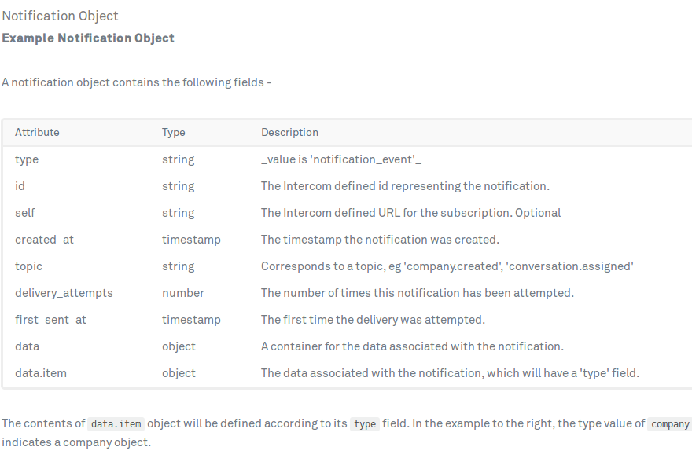
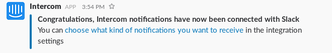
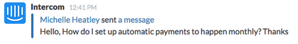
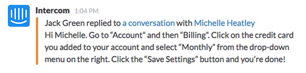
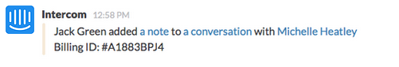

[Intercom](https://www.intercom.com/) is a service for implementing effective communication with the customers on a connected platform which enhances efficiency and reduces costs.

Intercom already has integrations with Slack and also supports webhooks.
It can send out a notification to Slack for the following cases:
 - New message from a user or lead
 - Reply from a user or lead
 - Conversation opened
 - Conversation closed
 - Reply from your teammates
 - Note added to a conversation
 - Conversation assigned to any teammate
 - User created
 - Company created
 - Lead signs up

The notification model is:
 

The integration added notification is:
 

The user message notification is:
 

The user reply notification is:
 

The note added notification is:
 

Other screenshots could not be added as they require a paid subscription to intercom services.

**Links**
 
Slack API: https://api.slack.com/
 
Intercom API: https://developers.intercom.com/v2.0/reference#webhooks-and-notification
