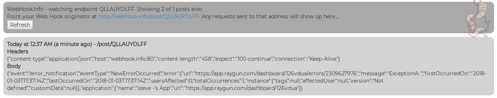

# Researching How Raygun Integrations Should Work

## Preface

This document will explain:

* How to add an incoming webhook to [Raygun](https://raygun.com/)
* What kind of payloads to expect from Raygun
* Kinds of messages that one may get from Raygun

This document assumed the user has their **Raygun** account and has set up
their **Raygun4Net** instance in their own language (check
[here](https://raygun.com/docs/languages/) for more info). This assumption is
made to make the notes more short and straight to the point.

Any suggestions about this document that can improve its quality are more than
welcome.

## Adding an incoming webhook to Raygun

This incoming webhook is used to make a POST HTTP request by Raygun. In this
demonstration, a [webhook.info](webhook.info) instance will be used as the
incoming webhook. The application used will have this configuration at its
creation:

0. Go to [webhook.info](webhook.info) and **Create New Endpoint**. Copy the
   URL. This URL will be used as the incoming webhook.

1. Click the integration section, on the left sidebar, below Application
   settings:
   

2. Click the webhook section:
   

   You should see this menu after clicking it:
   

3. Click **Setup** and set the webhook url. It should look something like this:
   

You're pretty much done at this point.

## What kind of payload to expect from Raygun

Briefly speaking, you'll find four types of payloads:

1. Error/crash
2. (1)'s status in Raygun is changed
3. (1) in Raygun is assigned to an user
4. A comment is added for (1) in Raygun

*Note: A more detailed documentation of the payloads can be seen at the
official Raygun docmentation
[here][https://raygun.com/docs/integrations/webhooks).*

In the next section we'll be analyzing certain things that one may
get from a payload.

### Structure of the payload

`event`: Currently known events are `error_notifications` and `error_activity`. 
The first one came from the application and the second one comes from Raygun
panel (manually and intentionaly triggered by the user).  
`eventType`: Type of the event. This varies depending on the `event` that you
receive. For `error_notifications`, it can be `NewErrorOccurred` until
`HourlyFollowUp`. For `error_activity`, it can be `StatusChanged`,
`AssignedToUser`, and `CommentAdded`.  
`error`: Contains a dictionary detailing the error details. **This name is
misleading**. It can also contain a description for a Raygun activity such as
error assignment messages or error status that has changed.

`url`: An URL of the error that redirects to Raygun  
`message`: Message of the error in notifications/Message of the activity.  
`status`: The status change for the error. Only for activity.  
`user`: The user who did the status change. Only for activity.  

`firstOccurredOn`: *self-explanatory*. Only for notifications.  
`lastOccurredOn`: *self-explanatory*. Only for notifications.  
`activityDate`: The time this activity occurred. Only for activity.
`usersAffected`: Number of users affected by this exact error in integer. Only
for notifications.  
`totalOccurrences`: Number of times this exact error has ever happened in
integer. Only for notifications.  
`instance`: Contains the instance of the error. Only for notification.

`tags`: Error tags.  
`affectedUser`: The identity of the user affected by the error  
`Identifier`: Unique identifier of the user
`IsAnonymous`: true or false  
`UUID`: Unique identifier of the user. From observation, seems like this value
is the same with `Identifier`.  

`customData`: Custom data supplied by the error. If there is none, it it
`null`.

`application`: Contains the data of the application

`name`: Name of the application in Raygun  
`url`: URL to the application in Raygun

## Possible messages

Based on Slack, the user can expect these types of messages.

Test message:

Exception error messages:

Error assigned to user:

Error resolved:

Error reactivated:

Error ignored:

Repeated error messages:

Repeated error resolved:

Repeated error reactivated:

Repeated error assigned:

Repeated error ignored:

These messages requires another interaction further from the user. Which
require sending another data **to** Raygun. But the conclustion that can be
made is: Raygun sends a webhook message when an error is happening, or when an
action is being taken for an error.

