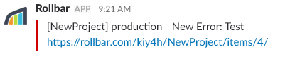
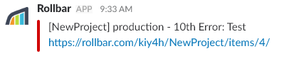
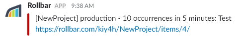
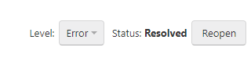
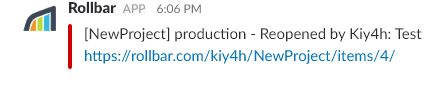
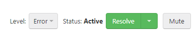
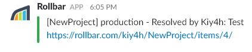
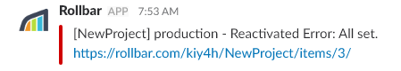
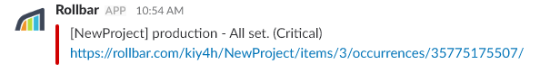

# Rollbar Integration Investigation

**[Rollbar](rollbar.com)** is a software to catch errors, detect signals in data, and instantly identify root cause in minutes.

## Configuring the webhook

Sign in to Rollbar and install it, the steps to set it up are written in [the Rollbar homepage](https://rollbar.com/?dr). Follow the instructions. You can use any platform. (e.g. Python, Ruby, Android)

Configure the script and run it, the script will deploy into your Rollbar Project, which you can find it at `https://rollbar.com/<username>/<projectName>/items/`. I think you're pretty much done at this point.

## Possible messages

### 1. Test message

In Rollbar, go to **Dashboard > Settings > Notifications > Slack**, then press "Send Test Notification". The Rollbar webhook will send the message below.

### 2. New occurrence

Deploy an Error by running your script, the Rollbar webhook will send a message similar to the message below:

### 3. (10^n)th occurrence

Deploy 10^n times and Rollbar will send a message:

### 4. High occurrence rate

Deploy 10 or more times in five minutes.

### 5. Reopened

Reopen a solved item by pressing the Reopen button that looks like below:

Rollbar will send a message similar to the message below.

### 6. Resolved

Resolve an item. You can resolve an item by going into your item and press the "Resolve" button.

The message shown below will be sent by Rollbar.

### 7. Reactivated

Reactivate an item by deploying a resolved item.

### 8. Every occurrence

The message below will be sent for every occurrence.

## Notes

I wasn't able to get request data for the "Deploy" event, the Rollbar API documentation isn't complete. They don't have an instruction to deploy to Rollbar. But I've never really played around with something called "deploy", so I may be wrong.
